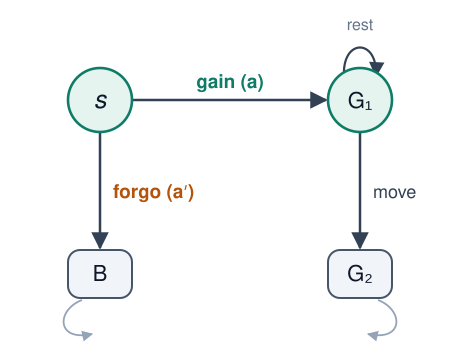
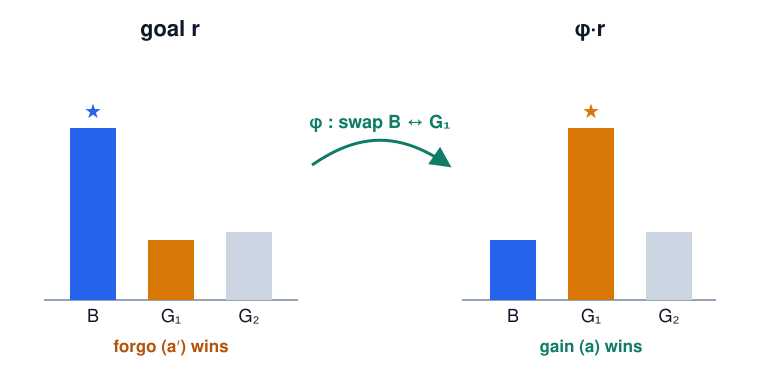

---
# ---------------------------------------------------------------------------
# NOT BUILT BY THE PIPELINE — COMPILE THIS BY HAND.
#
# This is Leon's original deck, authored in Marp (markdown + the CSS block
# below), not beamer. The build only compiles `slides.tex`, so nothing here is
# touched by `build-content.mjs` and no deck is produced from it. It lives in
# the repo so the deck has a source of truth alongside the worksheet instead of
# existing only as a PDF in Drive.
#
# To rebuild the PDF (needs an installed Chrome/Chromium/Edge — Marp drives it
# headlessly; it does not download a browser):
#
#     npm install @marp-team/marp-cli          # ~133 MB, do this OUTSIDE the repo
#     CHROME_PATH=$(command -v google-chrome) \
#       marp slides_marp.md --pdf --allow-local-files -o power-seeking-slides.pdf
#
# Takes about two seconds and emits 12 pages. Then upload the PDF to the Drive
# folder the worksheet's `slides:` key points at (see main.tex) — a folder link
# survives re-uploads where a file link does not.
#
# `mdp.svg` and `swap.svg` in this folder are the two diagrams it references.
# ---------------------------------------------------------------------------
marp: true
theme: default
paginate: true
size: 16:9
math: katex
title: Power-Seeking
author: Leon Lang
style: |
  section {
    font-family: 'Segoe UI', 'Helvetica Neue', Helvetica, Arial, system-ui, sans-serif;
    font-size: 25px;
    color: #1f2933;
    background: #ffffff;
    padding: 54px 70px;
    line-height: 1.45;
  }
  h1 { color: #0E7C66; font-size: 50px; margin: 0 0 .25em; }
  h2 { color: #0E7C66; font-size: 33px; border-bottom: 3px solid #d7ece4;
       padding-bottom: .12em; margin: 0 0 .55em; }
  strong { color: #0E7C66; }
  em { color: #b45309; font-style: italic; }
  a { color: #0E7C66; }
  ul, ol { margin-top: .15em; }
  li { margin: .28em 0; }
  blockquote {
    border-left: 6px solid #0E7C66;
    background: #eef7f3;
    margin: .55em 0; padding: .45em 1.1em;
    border-radius: 0 8px 8px 0;
  }
  blockquote p { margin: .2em 0; }
  code { background:#eef2f7; padding:1px 5px; border-radius:4px; font-size:.9em; }
  .small { font-size: .78em; color:#64748b; }
  .badge { color:#0E7C66; font-weight:700; }
  section::after {
    content: attr(data-marpit-pagination) ' / ' attr(data-marpit-pagination-total);
    color:#64748b; font-size:16px; font-weight:600;
  }
  section:not([data-marpit-pagination])::after { content: ''; }
  section.lead {
    background: #0E7C66; color:#ffffff;
    display:flex; flex-direction:column; justify-content:center;
  }
  section.lead h1 { color:#ffffff; font-size:66px; border:none; }
  section.lead h2 { color:#cdeee2; font-size:30px; border:none; margin-top:0; }
  section.lead p  { color:#bfe5d8; font-size:22px; }
  section.lead strong { color:#ffffff; }
---

<!-- _class: lead -->
<!-- _paginate: false -->

# Instrumental Convergence

## Will a trained AI seek power?

Following Alex Turner's work

Iliad Intensive  — Leon Lang

---

## The worry

Instrumental convergence: for a **wide range of goals**, a capable agent converges on the same intermediate moves — *acquire resources*, *stay operational*, *keep options open*.

These actions have in common that they "keep more options open". **Call this seeking power**: A position from which many futures stay reachable.

> We train an AI in an MDP to do well on a reward function.
>
> **Will it seek power, or not?**

---

## The central claim of Turner's work

> Under many **suitable decision rules**, and for the **majority of reward functions**, *keeping more options open* is the likelier outcome than keeping fewer.

Three phrases to make precise:

1. **for the majority of reward functions**
2. **a suitable decision rule**
3. **keeping more options open**

---

## Setup

- Rewardless MDP $\langle \mathcal S,\mathcal A,T\rangle$, discount $\gamma\in(0,1)$.
- A **goal** is a reward $r\in\mathbb R^{d}$, with $d=|\mathcal S|$.
- A policy's value is **linear** in the reward, $V^\pi_r(s)=f^\pi(s)^\top r$, where

  $$ f^\pi(s)=\sum_{t\ge 0}\gamma^{t}\,(T^\pi)^{t} e_s $$

  is the **discounted state-visitation count**.

---

## ① For the majority of reward functions

We have uncertainty in the reward function: The specification depends on the developers, and the learned reward is **procedure-dependent**.

→ Model the uncertainty as a distribution $\mathcal D\in\Delta(\mathbb R^{d})$ over goals. *"Most goals" means $\mathcal D$-most.*

**Symmetry of $\mathcal D$:** a state-relabelling $\phi$ with $\phi_*\mathcal D=\mathcal D$.

> If two regions look alike to the specification procedure, swapping them leaves every goal equally likely.

*Trivial case:* if rewards are i.i.d. across states, **every** permutation is a symmetry.

---

## ② A suitable decision rule

A **decision rule** $p(X\mid s,r)$ = probability the chosen option lands in $X$, where $X$ is a set of state-visitation counts. It looks at options only through their **quality** $f^\top r$:

**Score rules** are the notion we focus on:

$$ p(\{f\}\mid s,r)=\frac{\nu(f^\top r)}{\sum_{h}\nu(h^\top r)},\qquad \nu\ \text{nondecreasing.} $$

Boltzmann ($\nu=e^{q/T}$) and satisficing ($\nu=\mathbf 1[q\ge t]$) are score rules.

---

## ③ Keeping more options open

An **option** from $s$ is a visitation distribution $f^\pi(s)$; those whose first action is $a$ form $\mathcal F(s\mid a)$.

*$a$ keeps at least as many options as $a'$* when $\mathcal F(s\mid a)$ **contains a copy** of $\mathcal F(s\mid a')$:

$$ \phi\cdot \mathcal F(s\mid a')\ \subseteq\ \mathcal F(s\mid a) $$

— every option after $a'$ has a **relabelled twin** after $a$. (Checkable from the dynamics: a one-sided embedding of the $a'$-branch into the $a$-branch.)

---

## The headline result

Let $p$ be a **score rule**, and $\phi$ an involution that

- **(E)** embeds $a'$ into $a$: $\ \phi\cdot\mathcal F(s\mid a')\subseteq\mathcal F(s\mid a)$
- **(D)** is a symmetry of $\mathcal D$: $\ \phi_*\mathcal D=\mathcal D$

Then:

> $$ \Pr_{r\sim\mathcal D}\big[\,A(r)\ \ge\ A'(r)\,\big]\ \ge\ \tfrac12 $$

with $A(r)=p(\mathcal F(s\mid a)\mid s, r)$ and $A'(r)=p(\mathcal F(s\mid a')\mid s,r)$.

**For $\mathcal D$-most goals, the option-richer action is at least as likely.**

---

## Why it's true: pair goals by the swap

- **Retarget.** If a goal prefers $a'$ ($A'>A$), the *relabelled* goal $\phi\cdot r$ prefers $a$ ($A>A'$) — the score rule + embedding flip the preference.
- **Pair.** $\phi$ is measure-preserving ((D)) and an involution, so it **injects** $\{A'>A\}$ into the set $\{A>A'\}$.
- Hence $\mathcal D\{A'>A\}\le\mathcal D\{A>A'\}$; the two are disjoint, so $\mathcal D\{A'>A\}\le\tfrac12$ — i.e. $\Pr_{r\sim\mathcal D}[A\ge A']\ge\tfrac12$. $\quad\blacksquare$

---

## Example: gaining resources

- **gain** $(a)$: reach $G_1$ — *rest* there, or *leverage* it to a further outcome $G_2$.
- **forgo** $(a')$: the single modest outcome $B$.

Options, for any $\gamma<1$:

$$\begin{aligned}
f' &= e_s+\tfrac{\gamma}{1-\gamma}\,e_B\\[2pt]
f_{G_1} &= e_s+\tfrac{\gamma}{1-\gamma}\,e_{G_1}\\[2pt]
f_{G_2} &= e_s+\gamma\,e_{G_1}+\tfrac{\gamma^2}{1-\gamma}\,e_{G_2}
\end{aligned}$$

---

## The swap: $\phi=\mathrm{swap}(B,G_1)$

- $\phi\cdot f'=f_{G_1}\in\mathcal F(s\mid a)$ — **(E)** holds; **(D)** holds whenever $\mathcal D$ is exchangeable in $B,G_1$.
- A goal prizing $B$ (forgo) $\mapsto$ a goal prizing $G_1$ (gain). The leverage option $G_2$ has **no forgo-side twin** $\Rightarrow$ gain is *strictly* favored.

---

## Why it matters

- **(D)** says training is, a priori, as likely to prize *stay modest* $(B)$ as *get resources* $(G_1)$.
- That exchangeability is what **alignment research might want to break** — by reliably encoding "stay modest" / "accept shutdown" / "seek no power" as part of the goal.

\\

> **Recap of the headline result.** Under many **suitable decision rules**, and for the **majority of reward functions**, *keeping more options open* is the likelier outcome than keeping fewer.
